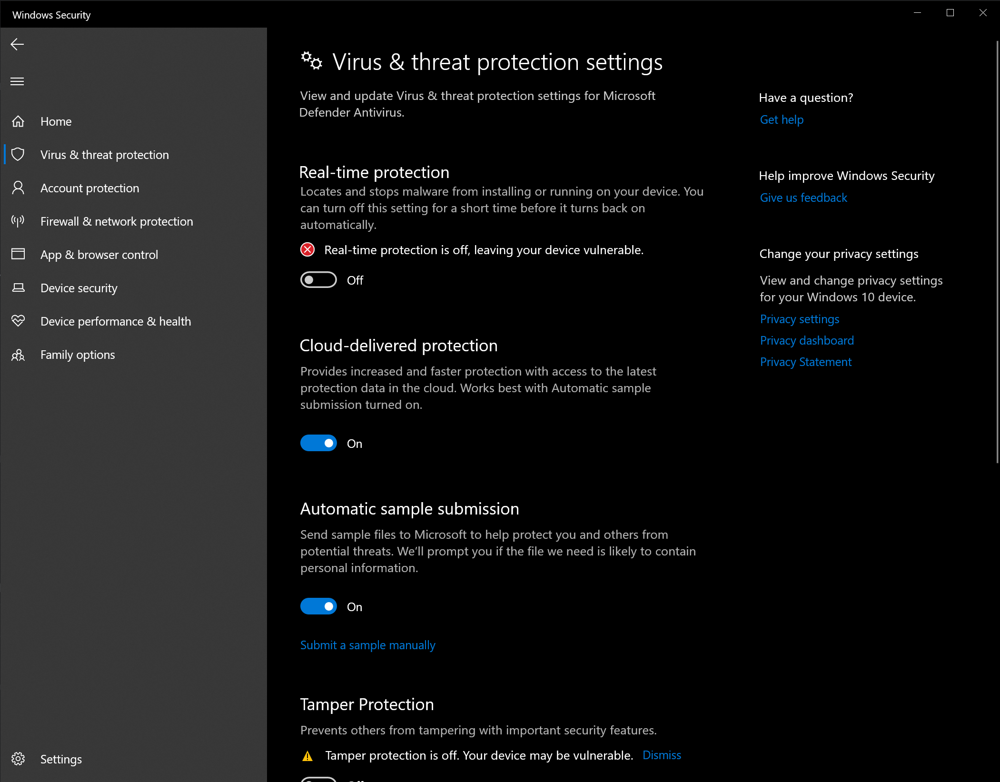

# 4️⃣ Antivirus

***

### _<mark style="color:yellow;">Cette page vous aidera à désactiver votre logiciel antivirus dans Windows.</mark>_

Antivirus tiers :Appuyez sur la touche Windows, tapez "Ajouter ou supprimer un programme", et dans cette liste de programmes, supprimez tous ceux qui sont des antivirus. Voici une liste d'entre eux : &#x20;

[_<mark style="color:yellow;">**https://bestantivirus.com/antivirus-companies.html**</mark>_](https://bestantivirus.com/antivirus-companies.html)

#### Vous pouvez utiliser Defender Control pour désactiver la Sécurité Windows si vous êtes sous Windows 10 :

[_<mark style="color:yellow;">**https://mega.nz/file/hBlikayL#yw6giPaLYe4RMVhjTd7nB2aJ9jzz4lwCvYRCTWupbDg**</mark>_](https://mega.nz/file/hBlikayL#yw6giPaLYe4RMVhjTd7nB2aJ9jzz4lwCvYRCTWupbDg)

<figure><figcaption></figcaption></figure>

***

### Si vous n'êtes pas sous Windows 10, faites ce qui suit :

Désactivez la protection en temps réel dans Sécurité Windows.Vous pouvez également ajouter des exclusions au bas de la page pour éviter que vos chargeurs soient supprimés occasionnellement.

#### Si vous obtenez "Une erreur s'est produite lors de la tentative de chargement du pilote, veuillez contacter le support." ou une erreur DRIVER 0x1001-0x1003, désinstallez la dernière mise à jour de sécurité installée sur votre ordinateur.

<figure><figcaption></figcaption></figure>
